# Expressões Regulares (Regex) 

O que é uma Expressão Regular?
Uma expressão regular, ou Regex, são padrões utilizados para identificar determinadas combinações ou cadeias de caracteres em uma string. Ela faz parte do dia a dia de todos os programadores e administradores de infra. Por meio dela, podemos validar a entrada de usuários ou encontrar alguma informação em logs, documentação ou saída de comando. O mais legal é que as Regex são escritas independentes de uma linguagem de programação.

Site usado para fazer teste de Expressões Regulares:
https://regexr.com/

1 - toda expressão regular fica entre duas barras:
```
/expressão regular/
```

### Opções de Execução - Flags

2 - Flags são as letras que ficam no final da expressão regular EX:
```
/expressão regular/g
```
g - (global): Diz que ele vai selecionar todas as ocorrencias que encontrar não só a primeira.

i - (case insensitive): Não vai fazer distinsão entre maiúsculo e minúsculo

m - (multiline): modifica o significado de ^ e $, assim ele executa associandoo inicio e fim, respectivamente, de alguma linha

### Teste de Expressão regular (java script)

- Tem duas formas: Usando uma string para testar um expressão e usando uma expressão para testar uma string.

Usando o texto para testar a expressão regular:
```javascript

let text = 'este é um texto';
let regex = /texto/g;

let results = text.match(regex);
console.log(results);
```

usando uma expressão para testar uma string.
```javascript

let text = 'este é um texto';
let regex = /texto/g;

let results = regex.exec(text);
console.log(results);

//ou

let results = regex.test(text);
console.log(results);
```

### sintaxe

. - qualquar caractere exceto o '\n'

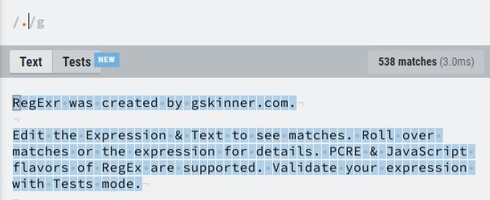

Quando você coloca um acaracter mais um ponto: Ele vai selecioar apenas o que tem o caractere seguido de qualquer outra letra.

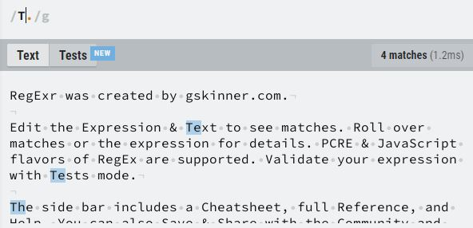

| (ou) ou ele vai pegar um elemento ou outro

Ex: Você quer selecionar um "e" ou "é"

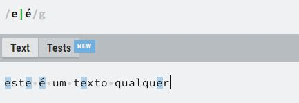

agrupamento: Você usa o () para formar um grupo

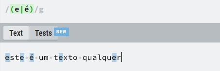

padrão: é usado []. ele pega cada caractere individulmente (ele não pega sequencialmente).

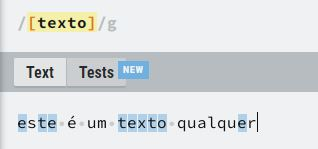

Repare que ele não pega a palavra texto e sim cada caractere individual

Isso é muito usado para uma sequencia de caracteres:

Ex: 
- Pegar todas as letras de "a" a "e"

```
/[a-e]/g
```

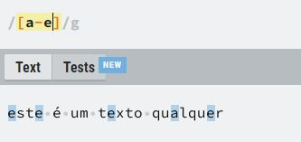

- Pegar todas as letras de "a" a "z"

```
/[a-z]/g
```

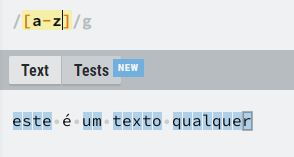

- Pegar todos os algarismos de 0 a 9

```
/[0-9]/g
```

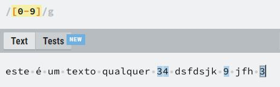

^ (negar) - significa que vai pegar todos os elementos **menos** os caracteres destacados

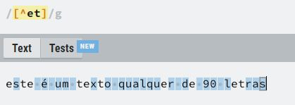

note que ele pegou todos os caracteres menos o "e" eo "t"

- Pega a sequencia de caracteres. Nesse caso minúsculo de a - z

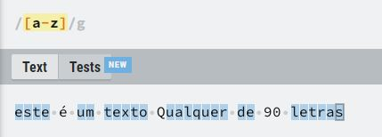

note que caracteres especiais, letras maiusculas e numeros não foram pegos

- Pega a sequencia de caracteres em maiusculo. 

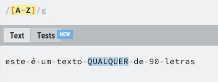

- . O ponto significa que vai pegar o caractere mais qualquer coisa que está do lado direito do caractere

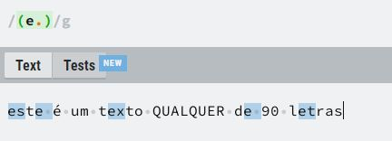

- + O (+) ele vai pegar o caractere e um grupo de dois dos mesmos caracteres seguidos.

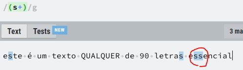

- * o caractere que precede o asterisco pode ser repetido 0 ou mais vezes

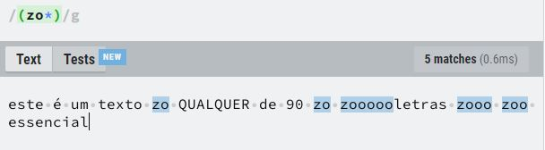

- ? Refere que o grupo é opcional ele vai retornar true tendo ou não aquele grupo.

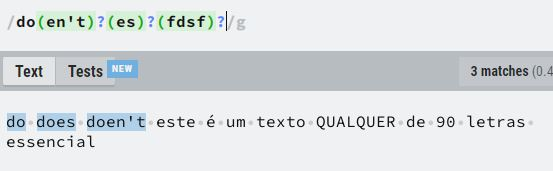

- caractere{numero_vezes} - repetição com número exatos.

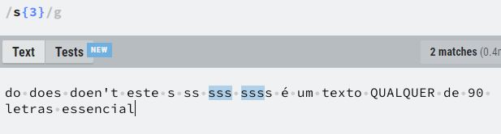

você pode pegar caracteteres que se repetem no intervalo

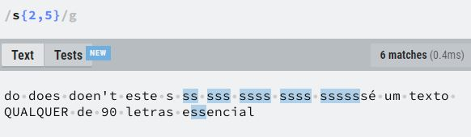

- ^ no incio - ele pega a expressão ou caractere se ele começa no início da frase.

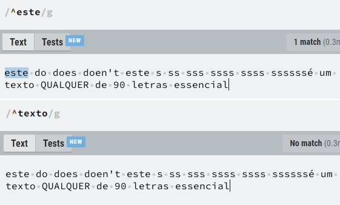

- $ no final - ele pega a expressão ou caractere se ele termina o final da frase com a expressão.

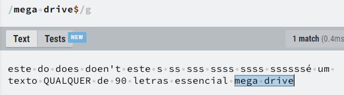

- Para pegar literalmente o caractere especial usado na busca pelo Regex. Usa uma barra invertida: Ex: \. \$ \? \+


https://www.youtube.com/watch?v=tlVI8mV1dQY
